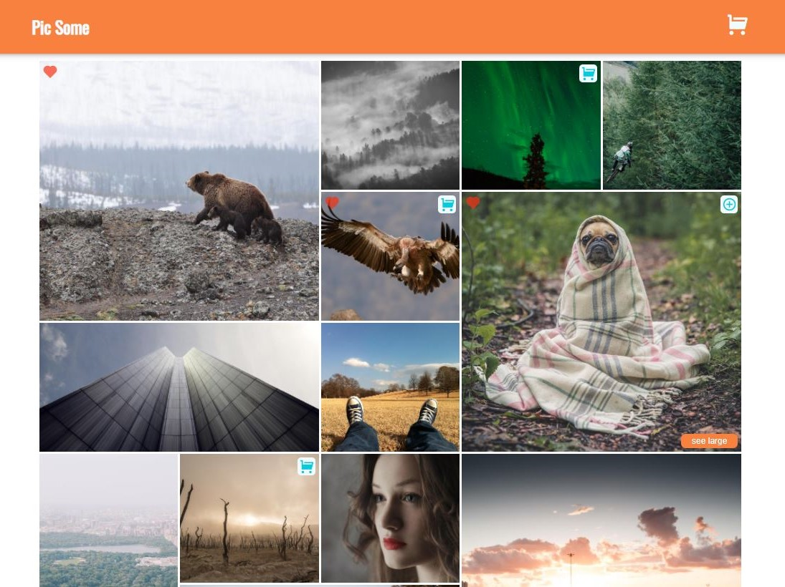
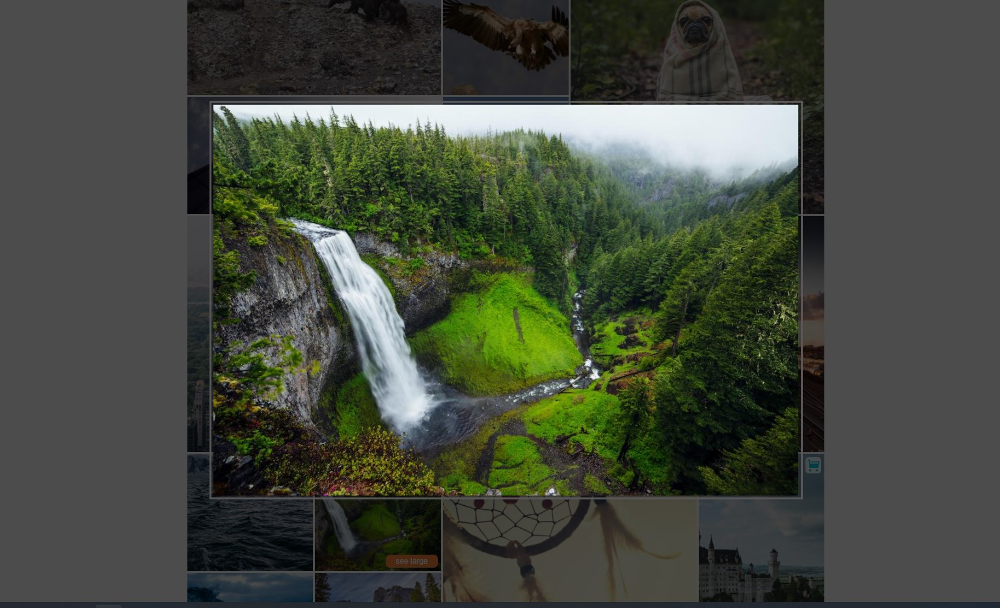
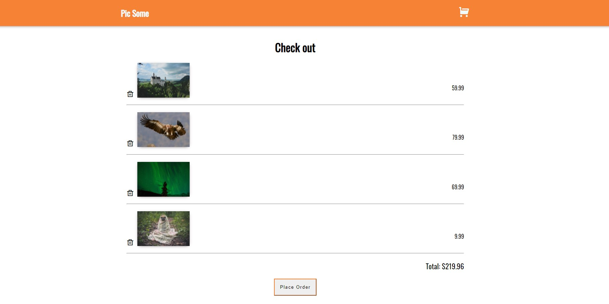

# Pic Some App

The Pic Some App is a mock image retail store. It allows the user to scroll through images, favorite and/or add them to their cart. View live [here](https://pict-some.netlify.app/).

## Motivation

I completed the initial version of this app as part of a series of challenges presented in [The React Bootcamp](https://scrimba.com/learn/react). _I thought it could be better_ though, so I added more functionality. Here is a list of additions I made to the original app:

- Responsive image sizing for the grid layout.
- Altered cart icon for better visibility.
- Implemented a modal popup for viewing images in a large display.
- Implemented a random price from $10-100 for each image.
- Revamped the Total($) in the checkout page to incorporate the aformentioned random prices.

## How to use

As you hover over each image, three options appear:

1. A heart to favorite images
2. A plus icon to add the image to your cart
3. A "see large" button to enlargen the image in a modal.
   

Example of an open model (escape by clicking the x in the upper right, clicking anywhere outside the modal image, or by pressing esc).

Example of the checkout page where you can view the total, remove items from your cart, and "place your order".

**_Please note_**: This not a functioning store. Clicking "Place Order" resets the cart and creates an alert that says your order was placed, but does not mean you actually purchased anything.

## What I learned

While completing this project I reinforced my knowledge of how to implement propTypes for components, fetch data from an external API, store data in state, and subsequently manipulate that data according to user input. I also learned how to implement a modal from scratch within React.

## Technologies

[React](https://reactjs.org/),
[React Router](https://reactrouter.com/)(v5)

## Credits

This project was bootstrapped with [Create React App](https://github.com/facebook/create-react-app).
[The React Bootcamp](https://scrimba.com/learn/react)
